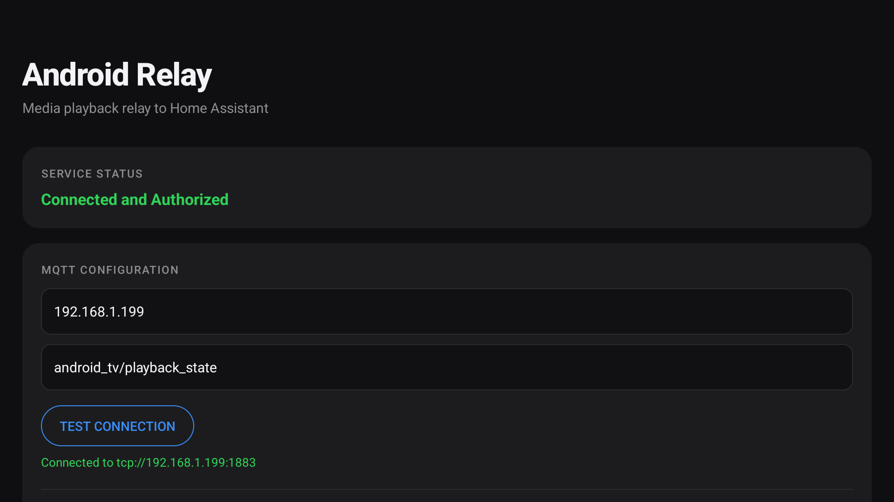

<h1>
  Android Relay
  
</h1>

**A high-performance, lightweight media relay for Android TV and Mobile**

Relay is designed to provide seamless media playback state reporting to Home Assistant via MQTT, optimized for maximum efficiency and a minimal system footprint.

<p align="center">
  
</p>
 
## Features & Performance

- **Instantaneous State Synchronization**: Real-time reporting of transitions and metadata changes with sub-100ms latency via event-driven callbacks.
- **Ultra-Lightweight Footprint**: Minimal 3.5 MB installation size and ~35 MB (PSS) memory usage.
- **Resource Efficiency**: ~4% CPU utilization during active relay, scaling to 0% when idle.
- **Intelligent Payload Caching**: Reduces redundant MQTT traffic by over 40% while preserving battery life.
- **Comprehensive Metadata**: Reports playback state (playing, paused, buffering), media title, artist, app package, and duration.

## Installation

### Option 1: Direct Install (Recommended)

1. Download the latest `android-relay.apk` from the [Releases](https://github.com/saihgupr/android_relay/releases) page.
2. Install the APK on your device (e.g., using ADB or a local file manager).

### Option 2: Build and Install via ADB

#### Prerequisites

- Android SDK 34
- Gradle 8.5+
- Java 21

#### Deployment

1. Connect to your device:
   ```bash
   adb connect <DEVICE_IP>:5555
   ```
2. Install the APK:
   ```bash
   adb install android-relay.apk
   ```

### Permission Granting

If manual permission granting is difficult (e.g., on certain Android TV interfaces), use the following command to allow notification access:

```bash
adb shell cmd notification allow_listener com.saihgupr.androidrelay/.MediaSessionListenerService
```

## Configuration

### In-App Setup

Launch the **Android Relay** application on your device to complete the following steps:

1. **Grant Permissions**: Enable the notification listener service.
2. **MQTT Integration**: Configure the MQTT Broker IP address and Topic.
3. **Verification**: Use the "Test Connection" tool to validate the setup.

### Service Persistence

The application utilizes a `NotificationListenerService`, which is managed by the Android system. Once enabled, the system automatically re-binds to the service upon device startup. No additional "Start at Boot" utilities are required.

## Home Assistant Integration

Integrate the relay into Home Assistant by adding the following sensor configurations to your `configuration.yaml`:

```yaml
mqtt:
  sensor:
    - name: "Android TV Media State"
      state_topic: "android_tv/playback_state"
      value_template: "{{ value_json.state }}"
      json_attributes_topic: "android_tv/playback_state"
      icon: mdi:television-play

    - name: "Android TV Current App"
      state_topic: "android_tv/playback_state"
      value_template: "{{ value_json.app }}"
      icon: mdi:application

    - name: "Android TV Current Title"
      state_topic: "android_tv/playback_state"
      value_template: "{{ value_json.title }}"
      icon: mdi:music-note

    - name: "Android TV Media Duration"
      state_topic: "android_tv/playback_state"
      value_template: "{{ value_json.duration }}"
      unit_of_measurement: "s"
      icon: mdi:timer-outline
```

## Support and Contributions

If you encounter any issues or have suggestions for improvements, please [open an issue](https://github.com/saihgupr/android_relay/issues). 

If you find it useful, consider giving it a star ⭐ or making a [donation](https://ko-fi.com/saihgupr) to support development.
